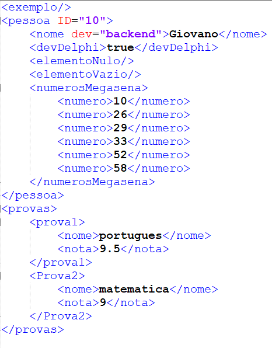

# Gerador de XML 

Aplicação console que permite criar **objetos personalizados**, adicionando **atributos, objetos aninhados e listas**, **gerando um XML válido** a partir dessas estruturas.  

## Funcionalidades

- Aplicação Windows
- Criação dinâmica de **objetos personalizados** via código.  
- Adição de **atributos** (chave → valor) a cada objeto.  
- Inclusão de **outros objetos dentro de objetos**, permitindo hierarquias complexas.  
- Criação de **listas de objetos**.  
- Geração automática de um **XML estruturado**.  

## Exemplos de Geração

- XML válido gerado pelo programa:



## Tecnologias
  - C#
  - Console
  
## Rodando localmente

Clone o projeto

```bash
  https://github.com/Je0225/GeradorXML.git
```

Abra o projeto no seu ambiente de desenvolvimento.
Altere a classe **Program** do programa e crie seus objetos.
Compile e execute o programa.

